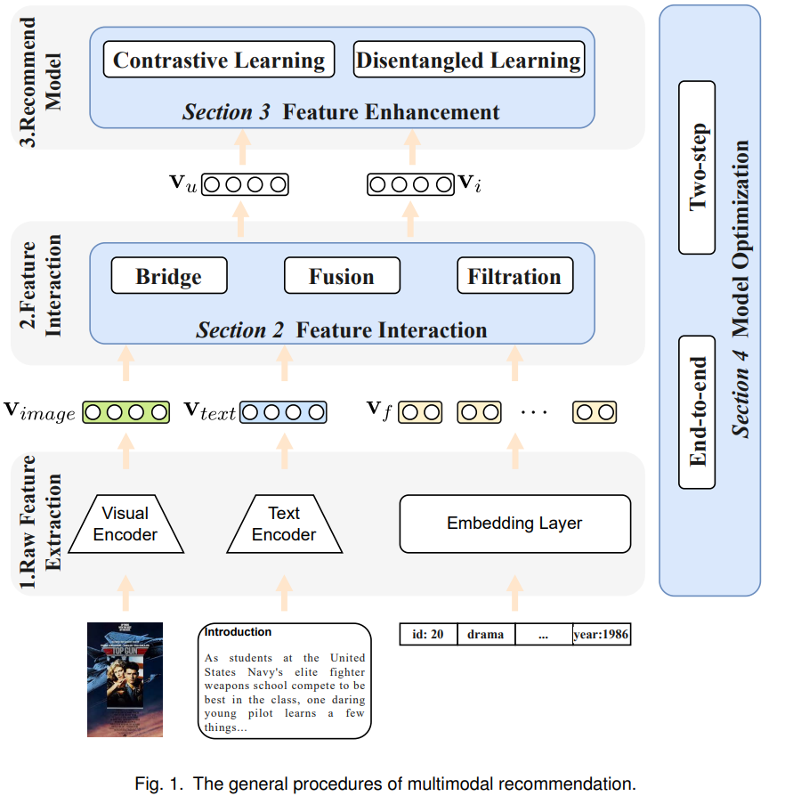

# Multi-Modal For Recommendation Engine

Can handle different modality information: audio, text, visual, interaction ,etc. Helpful to alleviate the cold start and data sparsity

## Components in multi modal recommendations:

### **Raw Feature Extraction Layers :**

There is two types of data:

1. Interaction Data
2. Multi-modal Data(Textual, visual, audio, etc)

These layers get the representations(features) from each modality encoders(ViT for images, BERT for textual and so on)

### **Feature Interactions**

We get representations from each modality encoders, but they are in different semantic space and also different users have various preferences for modalities.

MRS seeks to fuse and interact multimodal representations v𝑓 , v𝑖𝑚𝑎𝑔𝑒 and v𝑡𝑒𝑥𝑡 to get the item and user representations, which are important for recommendation models.

### **Recommendations**

After the second procedure, we get the representations of the user and item, denoted as v𝑢 and v𝑖.  The general recommendation models absorb these two representations and give the recommendation probability, such as MF.

### Three Challenges:

1. **Feature Interactions:** 
    - How to fuse different modality features in different semantic space and get preferences for each modality?
    - GNN and attention techniques are used to fuse and captures various modalities.
    
    Future interactions can be categorize in three types:
    
    1. Bridge
        1. User-item Graph
        2. Item-Item Graph
        3. Knowledge Graph
    2. Fusion
        1. Coarse grained Attention ([CMBF](docs/CMBF%20Cross-Modal-Based%20Fusion%20Recommendation%20Algor%2040ad6d716a794c599a471b29ad00054c.md))
        2. Fine grained Attention
        3. Combined Attention
    3. Filtration
        
        Multi modal might consists of information unrelated to user preferences. Filtering this noisy data can improve the recommendation performance.
        
        [VECF](https://dl.acm.org/doi/10.1145/3331184.3331254) and UVCAN perform image segmentation to remove noise from the image.
        
    
2. **Feature Enhancements:** 
    - How to get comprehensive representations for recommendations model under data sparse conditions?
    - Contrastive and Enchanted Learning can be used for feature enhancements.
    
    Contrastive Learning:
     - [HCGCN](https://dl.acm.org/doi/abs/10.1145/3503161.3548119) 
    
3. **Model Optimization:** 
    - How to optimize the lightweight recommendation models and parameterized modality encoder?
    - Design efficient methods to train the model with lightweight recommendation models and parameterized modality encoder.
    
    Categorized into:
    
    1. End-to-End Learning
        - End-to-end training can update the parameters of all layers in the model with each gradient obtained through backpropagation.
        - Training End-to-End might be expensive computationally. so, [NOVA](https://arxiv.org/abs/2103.03578) and [VLSNR](https://paperswithcode.com/paper/vlsnr-vision-linguistics-coordination-time) uses pretrained encoder to encoder images and texts.
        - [MCPTR](https://dl.acm.org/doi/abs/10.1145/3512527.3531378)  fine-tunes the encoder’s parameters with only 100 epochs
        by recommendation and contrastive loss
        
        
        
    2. Two step Learning
        
        While the two-step training includes the first stage of pretraining multimodal encoders and the second stage of task-oriented optimization.
        
        
        
    

## Open Source Library for multi-modal:

### [Mmrec](https://mendeley.github.io/mrec/)

### [**Cornac**](docs.md)

## Challenges:

1. Universal Solutions
2. Model Interpretability
3. Computational Complexity

### Dataset

[Dataset Repository](https://cseweb.ucsd.edu/~jmcauley/datasets.html#amazon_reviews)

References:

**[Multimodal Recommender Systems: A Survey](https://arxiv.org/pdf/2302.03883.pdf)**

[****CMBF: Cross-Modal-Based Fusion Recommendation Algorithm****](docs/CMBF%20Cross-Modal-Based%20Fusion%20Recommendation%20Algor%2040ad6d716a794c599a471b29ad00054c.md)